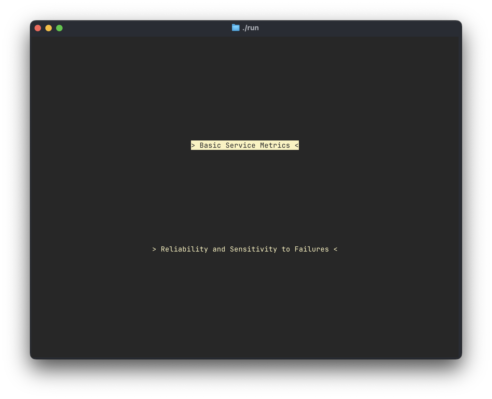
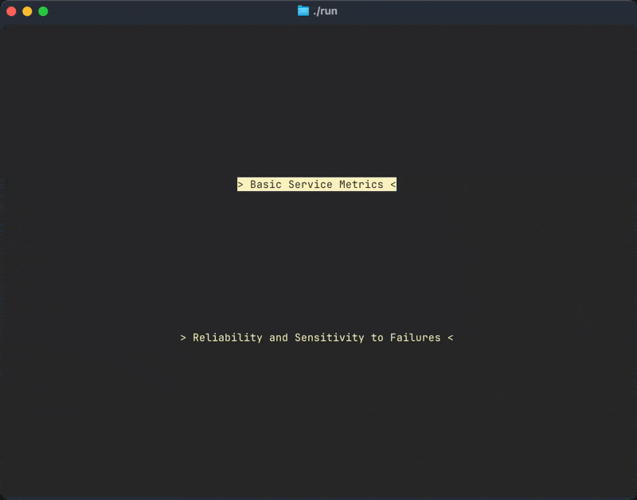
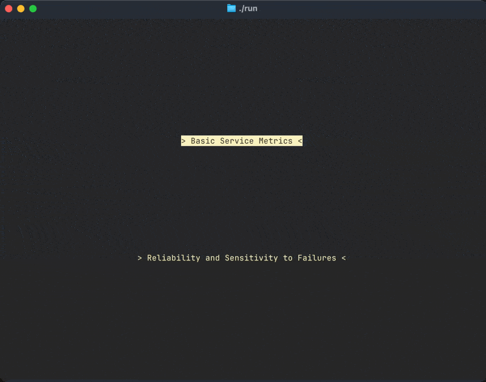

# Water Management System

This repository contains a **Water Management System** written in C++ using the [ncurses](https://invisible-island.net/ncurses/) library. The system provides a text-based user interface for modeling, simulating, and managing the flow of water through reservoirs, pumps, pipes, and cities.

The application constructs an internal **directed flow network** (with the option for bidirectional edges) by reading data from CSV files, building a graph (using `DataManager::buildGraph()`), and computing maximum flows via the **Edmonds-Karp** algorithm. Various UI components, built on ncurses panels, enable interactions such as searching, exporting flow data to file, simulating failures, and so on.

Below is an overview of the project’s structure, followed by build instructions and usage hints.

<div align="center">
    
</div>

---

## Table of Contents

1. [Project Structure](#project-structure)
2. [Key Features](#key-features)
3. [Dependencies](#dependencies)
4. [Build Instructions](#build-instructions)
5. [Running the Application](#running-the-application)
6. [Usage Overview](#usage-overview)
7. [Code Organization & Highlights](#code-organization--highlights)
8. [Acknowledgments](#acknowledgments)
9. [License](#license)

---

## Project Structure

```
water-management/
│
├─ src/
│  ├─ main.cpp
│  ├─ ui/
│  │  ├─ components/
│  │  │  ├─ Component.h/.cpp
│  │  │  ├─ InputBox.h/.cpp
│  │  │  ├─ MultiComponent.h/.cpp
│  │  │  ├─ OptionMenu.h/.cpp
│  │  │  ├─ SearchBox.h/.cpp
│  │  │  ├─ TextBox.h/.cpp
│  │  │  ├─ TextLabel.h/.cpp
│  │  │  └─ KeysBindings.h
│  │  ├─ colors/
│  │  │  ├─ Color.h/.cpp
│  │  │  ├─ ColorPair.h/.cpp
│  │  │  └─ pallets/gruvbox.h
│  │  └─ menus/
│  │     ├─ Buffer.h/.cpp
│  │     ├─ MainBuffer.h/.cpp
│  │     ├─ BasicMetricsBuffer.h/.cpp
│  │     ├─ FailureBuffer.h/.cpp
│  │     ├─ BalanceBuffer.h/.cpp
│  │     └─ ExportBuffer.h/.cpp
│  ├─ BaseClasses/
│  │  ├─ City.h/.cpp
│  │  ├─ Reservoir.h/.cpp
│  │  ├─ Pump.h/.cpp
│  │  └─ Pipe.h/.cpp
│  ├─ DataManagement/
│  │  ├─ DataManager.h/.cpp
│  │  └─ DataReader.h/.cpp
│  └─ GraphClasses/
│     ├─ Graph.h/.cpp
│     ├─ Edge.h/.cpp
│     ├─ Vertex.h/.cpp
│     └─ StaticGraph.h/.cpp
│
├─ CMakeLists.txt    (or your chosen build system)
├─ data/             (Sample CSV data files for cities, pipes, pumps, etc.)
└─ README.md         (this file)
```

### File/Directory Description

- **`main.cpp`**  
  The entry point of the application. Initializes ncurses, reads data files, builds the graph, runs the Edmonds-Karp algorithm, and transitions into the ncurses-based UI flow.

- **`ui/components/`**  
  Contains the reusable UI widgets built on top of ncurses. This includes `Component` (the base of all UI elements), text boxes, menus, search boxes, labels, input boxes, etc.

- **`ui/colors/`**  
  Encapsulates color usage through `Color` and `ColorPair` classes. `gruvbox.h` is a color palette.

- **`ui/menus/`**  
  Higher-level screens, each subclassing from `Buffer`, representing the logical “pages” or “buffers” in the TUI (e.g., `MainBuffer`, `BasicMetricsBuffer`, `FailureBuffer`, etc.).

- **`BaseClasses/`**  
  Models the domain: `City`, `Reservoir`, `Pump`, and `Pipe`. Each includes static containers and methods to manage objects by unique codes.

- **`DataManagement/`**  
  Provides file I/O for reading CSV files (`DataReader`) and the logic for building a `Graph` from the domain classes. It also houses the `DataManager` with the **Edmonds-Karp** implementation.

- **`GraphClasses/`**  
  Contains the flow network logic. `Graph` holds vertices (`Vertex` objects) and edges (`Edge` objects). `StaticGraph` provides a global pointer `graph_` for the entire application.

---

## Key Features

1. **Edmonds-Karp Maximum Flow**  
   Automatically computes flows after reading the input data. Supports interactive UI updates (e.g., removing or “failing” edges).

2. **Failover Simulation**  
   Through the *FailureBuffer*, you can mark certain Pumps/Pipes/Reservoirs as under maintenance. The application recalculates flow to show “affected cities.”

3. **Basic Metrics**  
   The *BasicMetricsBuffer* allows quick queries into city flows, demands, deficits, etc.

4. **Search & Navigation**  
   A custom *SearchBox* component allows searching through lists of items (like cities, pipes, or reservoirs). Various UI elements can highlight and handle user inputs (arrow keys, ENTER, ESC, etc.).

5. **Export**  
   The system can export city flow data to a CSV file from the *ExportBuffer*.

---

## Dependencies

1. **C++17 (or higher) compiler**
2. **ncurses** library (is included with the project's build system)
3. **CMake**.

---

## Build Instructions

Below is an example using **CMake**:

1. Clone the repository:
   ```bash
   git clone https://github.com/ricardoramo-s/water-management.git
   cd water-management
   ```
2. Run the `install` script:
   ```bash
   ./install
   ```
3. Compile and run the code:
   ```bash
   ./run
   ```

If for some reason there are issues with the installation or configuration of ncurses (since the project needs ncursesw and extended color support), remove the `ncurses-6.4` and `build` folders and run `./install` again. 

---

## Running the Application

1. Ensure you have the required CSV files in a folder named `data/` (or correct path) with the expected naming (e.g., `Cities.csv`, `Pipes.csv`, `Reservoirs.csv`, `Stations.csv`).
2. Launch the compiled binary in a terminal that supports ncurses (`xterm-256color`):
   ```bash
   ./run
   ```
3. The application will attempt to read from `./data` by default. Adjust the paths in `main.cpp` or your environment as needed.

---

## Usage Overview

- **Navigation**
    - Press `TAB` to cycle focus between different components on a single screen.
    - Use the **arrow keys** (`↑`, `↓`, `←`, `→`) to move through lists, or menus.
    - Press **ENTER** to select the highlighted item.
    - Press **ESC** to cancel or go back in certain contexts.

<div align="center">
    
</div>

- **Main Menu** (`MainBuffer`)
    - Contains two primary options: **Basic Service Metrics** and **Reliability and Sensitivity to Failures**.
    - Press ENTER on either option to jump to that screen.

<div align="center">
    
</div>

- **BasicMetricsBuffer**
    - Displays search box for cities, plus metrics (flow, demand, deficits, etc.).
    - Allows exporting data to file or checking the system’s “Balance.”
    - **BalanceBuffer**
      - Summarizes old vs. new metrics (average, variance, max difference, etc.) if needed for comparing pre/post flow computations.
    - **ExportBuffer**
        - Enter a filename to export city flow data to CSV.
        - Press ENTER to confirm, or ESC to return.

<div align="center">
    
</div>

- **FailureBuffer**
    - Lets you place pipes/pumps/reservoirs on maintenance. The flow is recalculated, and the screen shows “affected” cities.
    - You can remove items from the maintenance list to restore original flows.

<div align="center">
    
</div>

---

## Code Organization & Highlights

1. **UI Components (`src/ui/components/`)**
    - `Component`: Abstract base for all UI elements. Manages ncurses `WINDOW*` and `PANEL*`.
    - `TextBox`, `OptionMenu`, `SearchBox`, `InputBox`, `TextLabel`, etc. all extend `Component`.
    - Keyboard handling is done in `handle_input(int ch)`, with constants in `KeysBindings.h`.

2. **Menu Buffers (`src/ui/menus/`)**
    - Each menu screen extends `Buffer`, which itself is a `Component` that can manage child components.
    - E.g., `BasicMetricsBuffer`, `FailureBuffer`, `MainBuffer`.
    - Each implements `draw()`, `handle_input()`, and transitions to other buffers (screens).

3. **Graph & Flow (`src/GraphClasses/`)**
    - `Graph`, `Vertex`, and `Edge` hold typical adjacency info, including `flow`, `capacity (weight)`, and reverse edges.
    - `StaticGraph::graph_` is a global pointer that the UI can modify after each step (like failing edges).

4. **Data Management (`src/DataManagement/`)**
    - `DataReader` reads CSV files into the domain objects (`City`, `Pump`, etc.).
    - `DataManager` ties domain objects into the `Graph`, plus implements **Edmonds-Karp** for maximum flow.

5. **Domain (`src/BaseClasses/`)**
    - Classes for `City`, `Reservoir`, `Pump`, `Pipe`. Each holds relevant fields like capacity, demand, etc. Also, they store static maps of all created objects.

---

## Acknowledgments

- **ncurses** for terminal UI capabilities.
- The color palette is adapted from the [Gruvbox theme](https://github.com/morhetz/gruvbox).

---

## License

See [LICENSE](LICENSE) for details, or simply note that you may freely use, modify, and distribute this code.
